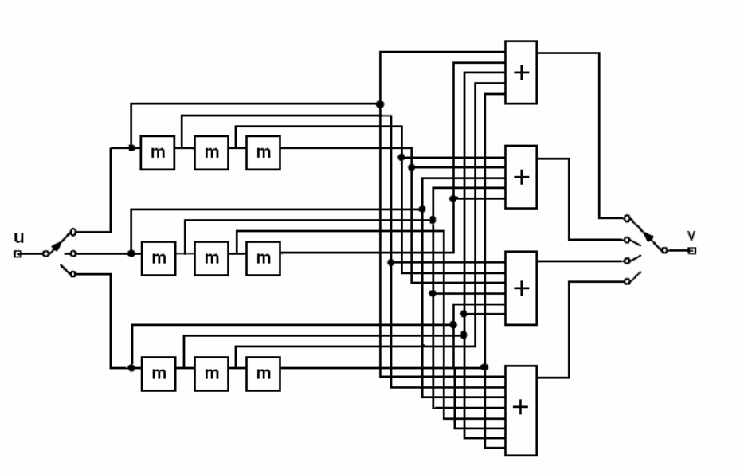
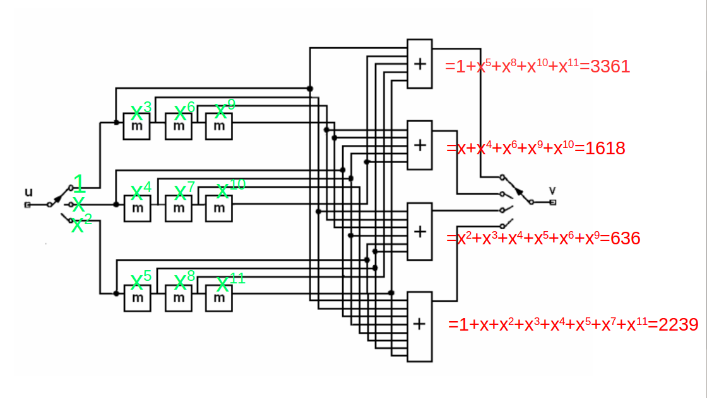
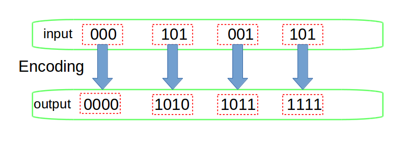

# Viterbi-decode-for-Convolutional-coding

Viterbi decoding for convolutional encoding, applicable to (N, K, M)convolution and not just (N, 1, M)convolution.

##### This Project is base on https://github.com/xukmin/viterbi. The project now supports convolutional decoding for (N, K, M), while optimizing the decoding time problem under long registers and adding constraints for the top 10 optimal beams.

### How to use it?

（4,3,3）convolutional encoding is illustrated in the following figure.We can decode this convolutional encoding by fllow code:

    std::vector<int> polynomials;
    polynomials.push_back(3361);
    polynomials.push_back(1618);
    polynomials.push_back(636);
    polynomials.push_back(2239);
    ViterbiCodec codec(12, polynomials); 
    TestViterbiDecoding(codec,
     "000010101011111110101010101000000100001101101000010100011000000011101010100110101001100001001010",//this string is need to decode
      "000101001101010101110011000000001001011110110011111011111111110000000000", 3); //This is correct string after decoding 

### Parameter Description：

The parameters we need to determine during decoding include polynomials, constraints, and stride.

The number of polynomials is determined by the number of outputs or N of (N, K, M),The coefficients of the polynomial are illustrated in the following figure.

The constraint coefficient is equal to the sum of polynomials，The constraint in the figure above is equal to 12.The description of stride is shown in the following figure.The stride of（4,3,3）convolution qeual to 3.

